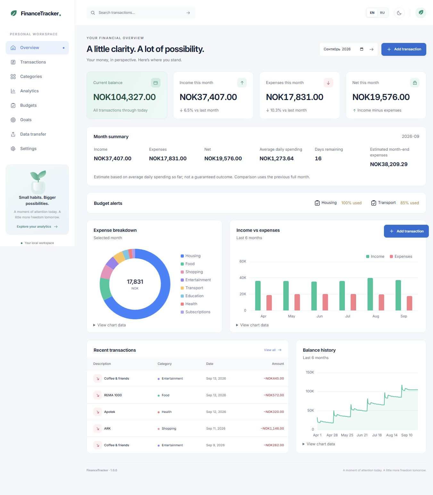
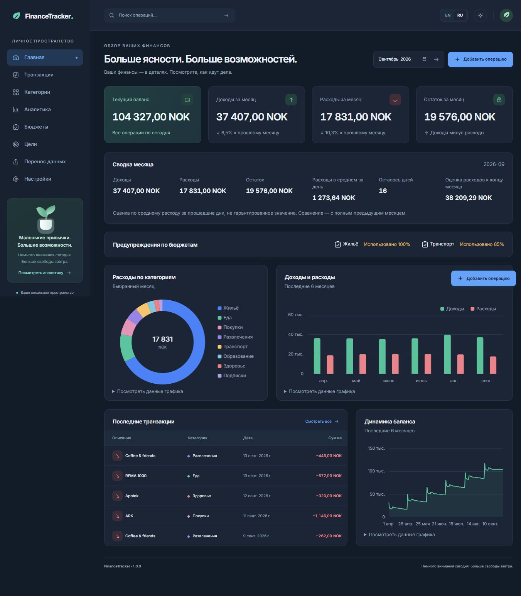
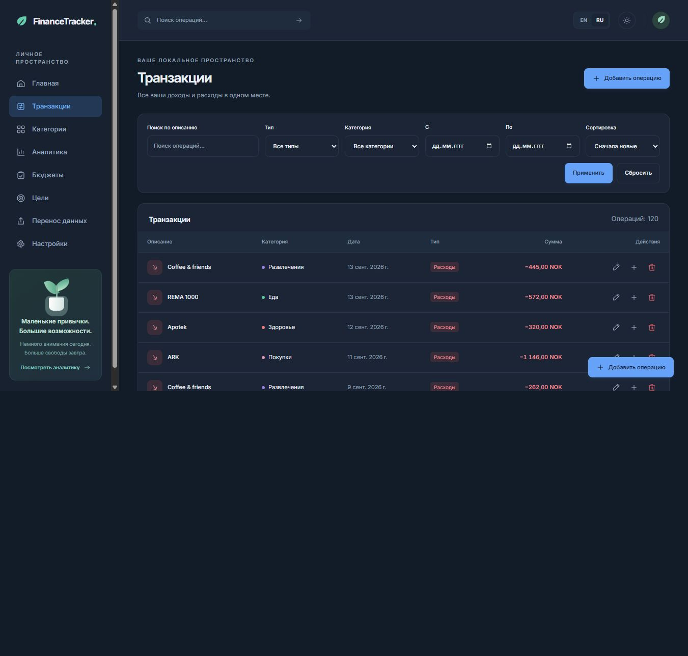
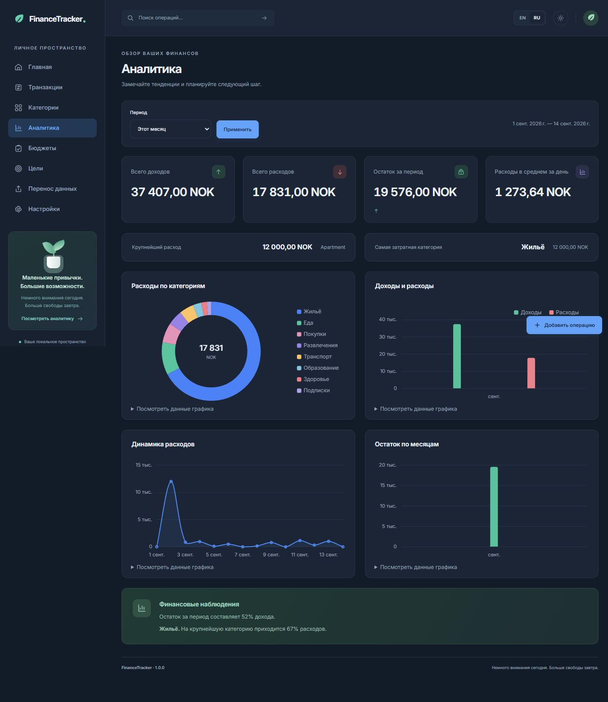
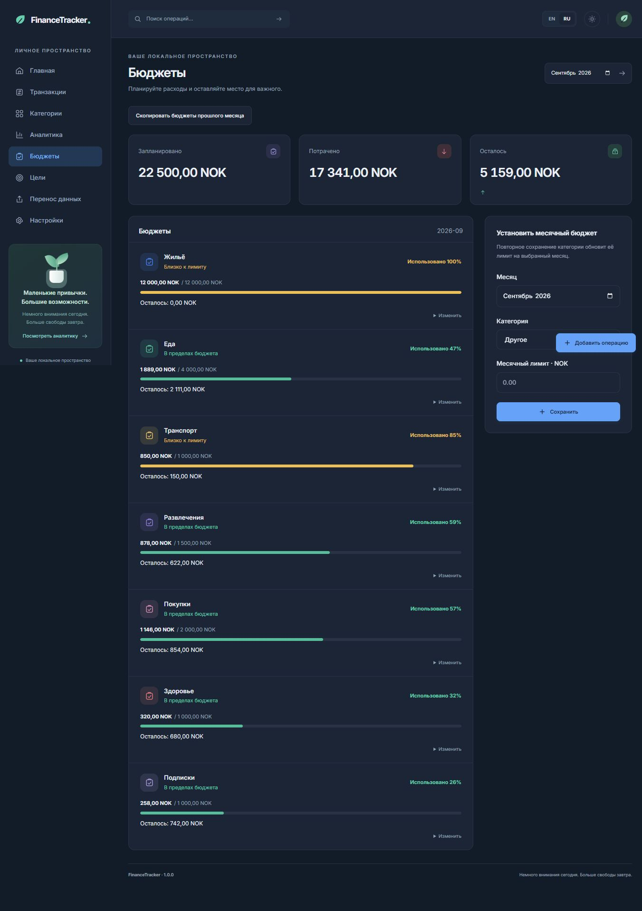
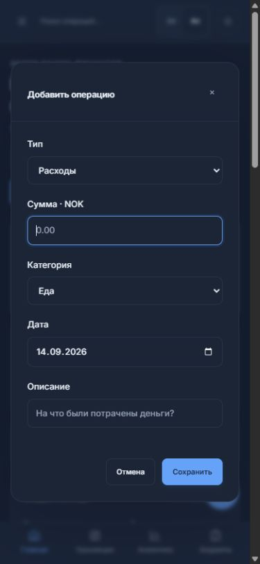

# Financial Tracker

A local personal finance application for tracking income, spending, monthly budgets and savings goals. Built with Flask and SQLite, with a responsive English/Russian interface and light/dark themes. Windows users can run the portable desktop build without installing Python.

## Screenshots

Screenshots below are from the working application with synthetic demo data.

| Dashboard · Light | Dashboard · Dark |
| --- | --- |
|  |  |

| Transactions | Analytics |
| --- | --- |
|  |  |

| Budgets | Mobile |
| --- | --- |
|  |  |

## Features

- Transactions: add, edit, duplicate with today's date, delete with a 20-second Undo, Unicode-aware search, filters, sorting and pagination.
- Quick Add: compact dialog, keyboard focus on amount, remembered category and a mobile floating action button.
- Dashboard: current balance, monthly income/expenses/net, previous-month comparisons, daily average, days remaining, estimated expenses and actionable budget alerts.
- Analytics: six reporting periods, custom dates, category breakdown, trends, monthly comparison, balance history and translated rule-based insights.
- Categories: stable internal system keys and separate editable custom categories.
- Budgets: spent/limit/remaining, textual status, progress and previewed copy from the previous month without overwriting existing limits.
- Goals: create, edit, add money, delete, per-goal currency and optional deadline. Goals are independent of monthly net and transactions.
- CSV import/export: UTF-8, category mapping, row validation, duplicate review and explicit import confirmation.
- Backup/restore: timestamped SQLite snapshots, preview, validation and an automatic safety backup before replacement.
- Persistent English/Russian language, NOK/EUR/USD/UAH currency and light/dark preferences.
- Windows portable build: bundled Python, automatic local port, single instance per data directory, readiness before opening the browser and shutdown from Settings.
- Alembic migrations preserve existing records across updates.

## Tech Stack

Python 3.11+, Flask, Flask-SQLAlchemy / SQLAlchemy, SQLite, Jinja2, Babel, Flask-WTF, Alembic, Waitress, JavaScript, Chart.js and PyInstaller. Localization uses JSON catalogs with Babel formatting (not Flask-Babel). Inter and Chart.js are bundled locally. No frontend build system or CDN is required.

## Download

For normal Windows use, download the **Windows portable ZIP** attached to this repository's GitHub Release. If you received the project directly, the same ZIP is generated under `release/` by `build.bat`. This source distribution is prepared for publication; a public GitHub repository/release URL has not been configured yet.

## Installation — Windows Release

1. Extract the **entire ZIP** to a folder.
2. Double-click `FinancialTracker.exe`.
3. Wait for your browser to open. Keep `_internal` next to the EXE.

Python, Flask, pip and PowerShell are not required. The build targets Windows x64. Closing a browser tab leaves the local server running; exit through **Settings → Quit application**. Reopening the EXE reuses the current instance.

**Русский:** распакуйте весь ZIP и дважды нажмите `FinancialTracker.exe`. Python не нужен. Выход: **Настройки → Завершить приложение**.

## Installation — Source

Install Python 3.11+ with **Add Python to PATH**, then clone or download this repository:

1. Double-click `setup.bat` once.
2. Double-click `start.bat` whenever you want to use the app.

Setup creates a virtual environment, installs dependencies and applies migrations. Start also checks setup, so it can prepare a fresh checkout. Internet is needed for first installation or dependency updates; normal app use is offline. Missing Python and setup errors keep the console open with instructions.

**Русский:** для исходников установите Python 3.11+, затем `setup.bat` → `start.bat`. Ручная активация окружения не нужна.

Manual developer installation:

```powershell
py -m venv .venv
.\.venv\Scripts\python.exe -m pip install -r requirements-dev.txt
.\.venv\Scripts\python.exe launcher.py
```

On macOS/Linux use `python3 -m venv .venv` and `.venv/bin/python` for the equivalent commands. Windows builds must be built on Windows.

## Localization

English and Russian have matching `app/translations/en.json` and `ru.json` catalogs. System category identifiers are language-independent; custom category names and descriptions remain user data. Services return translation keys and variables. Babel centralizes money, date and number formatting.

To add a language:

1. Copy `en.json` to a new locale file, e.g. `nb.json`.
2. Translate values, preserving keys and `{placeholders}`.
3. Register it in `Config.LANGUAGES`.
4. Add the locale to tests and check long text on mobile.

Native date pickers and browser-required-field messages follow the browser/OS language; application validation follows the selected language.

## Data Storage

| Launch mode | Data directory |
| --- | --- |
| Portable EXE | `%LOCALAPPDATA%\FinancialTracker` |
| Source launcher / Flask | `instance/` in the project |
| Isolated test/profile | `FINANCIAL_TRACKER_DATA_DIR` absolute path override |

Contents: `finance.db`, `backups/`, `logs/application.log`, `secret.key` and runtime lock/server metadata. The executable directory and temporary PyInstaller files never hold the default user database. The app version comes from `app/version.py`.

**Updating:** quit the app and replace the complete application folder. The data directory remains unchanged. Schema upgrades create a backup before migration. Do not delete the database to update.

**Moving to another PC or from source to EXE:** Settings → Create backup → Open backup folder. Copy the `.db` snapshot, then use Settings → Restore backup in the destination installation. Restore replaces transactions, categories, budgets, goals and preferences, and saves the current database first. New installations have no demo transactions.

Deleted transactions are excluded from every report, budget and export. Undo is available for 20 seconds and checked by the server. There is no separate trash interface after expiry; soft-deleted rows remain in the database and backups.

## Financial Definitions

- **Current balance:** income minus expenses through today; future records do not affect today's balance.
- **Monthly net:** selected-month income minus expenses. It is not a savings account or the sum of goals.
- **Comparison:** selected full month versus the previous full month. Zero baseline means no percentage; current partial-month comparisons are explicitly described as comparisons with the prior full month.
- **Estimated expenses:** spending through today divided by elapsed calendar days, multiplied by the number of days in the month. Days without spending count. It is an estimate, not a guaranteed outcome.
- **Budgets:** normal below 80%, warning from 80% through 100%, over budget above 100%. Text describes the status as well as color.
- **Currency:** workspace selection changes denomination/formatting, not exchange conversion. Each goal has its own currency; goals are not aggregated across currencies.

Money is stored as integer cents and parsed using Decimal. Positive transaction amounts accept a dot or comma with at most two decimals, up to 999,999,999.99.

## CSV Format

```csv
Date,Type,Category,Description,Amount
2026-09-14,expense,food,Groceries,125.50
2026-09-14,income,salary,Salary,32000.00
```

UTF-8/BOM, comma/semicolon/tab delimiters, ISO dates and `income` / `expense` types. Maximum 2 MB and 10,000 rows. Categories resolve by internal key, EN/RU label or custom name; unknown categories need mapping. Invalid rows must be corrected before confirmation.

Possible duplicates match date, amount, trimmed description and type, including repeats within the uploaded file. Choose **Skip** or **Import anyway**. Preview never writes financial records; confirmation validates again and commits atomically. The same batch cannot be committed twice; preview expires after 24 hours. Export protects spreadsheet-formula text. Use database backups for exact full-workspace transfers.

## Project Structure

```text
app/
  __init__.py        Application factory, request hooks, safe error handling
  version.py         One source of application version
  runtime.py         Persistent data and secret paths
  blueprints/        Ten feature route modules
  models/            Transactions, categories, budgets, settings, goals, import batches
  services/          Validation, persistence, import, backup and migration operations
  analytics/         Numeric calculations and insight keys
  templates/         Jinja pages and shared components
  static/            Local CSS, JS, Chart.js, Inter
  translations/      JSON language catalogs
migrations/          Alembic schema history
scripts/             Setup, packaging and build metadata helpers
tests/               Isolated automated tests
docs/screenshots/    Real application captures
launcher.py          Single-instance loopback desktop launcher
setup.bat / start.bat / build.bat
```

See [ARCHITECTURE.md](docs/ARCHITECTURE.md) for boundaries and design decisions.

## Development

```powershell
# Managed launch, automatic port
.\start.bat
# Standard Flask development entry point
.\.venv\Scripts\python.exe -m flask --app run run --host 127.0.0.1 --port 5000
# Apply migrations only
.\.venv\Scripts\python.exe -m flask --app run migrate-db
# Optional synthetic records, only when the transaction table is empty
.\.venv\Scripts\python.exe -m flask --app run seed-demo
```

Never run multiple manual servers on the same database during restore. For tests or demos, set `FINANCIAL_TRACKER_DATA_DIR` to another folder. `.env.example` documents optional configuration; the launcher generates a persistent random secret automatically. No `.env` is required for local launch. Do not enable Flask debug mode for testers.

## Build

Double-click `build.bat`. It produces the onedir application under `dist/FinancialTracker/`, a minimal versioned folder under `release/`, and its ZIP/checksum. `app/version.py` supplies the UI, Windows EXE metadata, package name and logs.

[BUILD.md](BUILD.md) explains packaged resources, relocation tests and update behavior. An installer is not required; the portable package is the supported distribution.

## Testing

```powershell
.\.venv\Scripts\python.exe -m pip install -r requirements-dev.txt
.\.venv\Scripts\python.exe -m pytest -q
```

Tests cover financial calculations, all CRUD paths, Unicode search, filters, duplication/Undo, goals, budgets, imports, backups/restores, migrations, preferences, CSRF, safe errors and the process lock. Use an isolated temporary path if your system temp directory is restricted. [VERIFICATION.md](docs/VERIFICATION.md) records actual results and limitations.

GitHub Actions is configured for Python 3.11/3.12 on Linux and Windows. A separate Windows workflow builds and smoke-tests the portable ZIP on manual dispatch or version tags. These hosted workflows have not been executed until the repository is published and Actions runs.

## Roadmap

Small follow-up candidates: recurring transactions, richer goal history and an optional signed installer. No cloud account, banking integration or telemetry is required by the current architecture.

## Privacy

Your financial data is stored locally on this device. The application uses no external financial service, CDN, analytics or telemetry. Installing dependencies is a developer/setup network action, not transmission of financial records.

The desktop server binds to `127.0.0.1`, checks allowed host names, and protects mutations with CSRF. Shutdown additionally requires a loopback client. This is a single-person local workspace with no online authentication. The portable release is not a public or LAN server; remote phone access is outside the supported release configuration.

Logs record error types and code locations without SQL parameters, record descriptions or secret values. Backups contain financial information and should be kept in a trusted location.

## License

Project code: [MIT](LICENSE). Chart.js: MIT; Inter: SIL Open Font License. Runtime distributions retain their own licenses; notices are collected into the Windows package. No dependency with a required proprietary runtime or payment is used.
